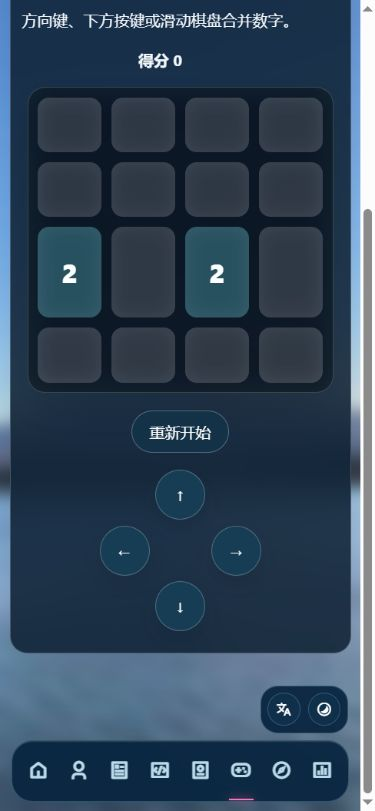

# 小游戏修复验证

已修复：控制区遮挡、Flappy 空格焦点与点击起飞、待开始/暂停/结束提示、切换及离开页面自动暂停、扫雷长按和标记模式、2048/华容道滑动、五子棋键盘落子与 AI 回调取消、扫雷格子标签、贪吃蛇满盘循环。

游戏逻辑移到 games.js；样式仅新增 games-page 范围规则。

验证：node tools/test-games.cjs 和 node --check games.js 通过；浏览器验证 Flappy 重开后空格、暂停、扫雷标记模式、2048 方向控制、五子棋键盘选位落子及 390×844 布局。控制台查询无 error/warn。

长按和滑动通过模拟事件测试，尚未在真实手机浏览器实测。

