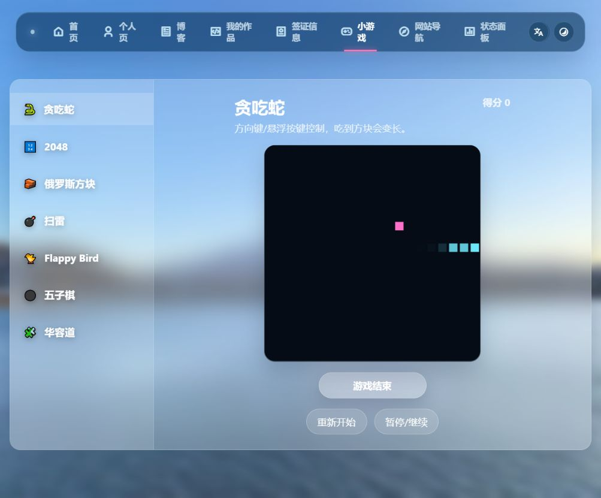
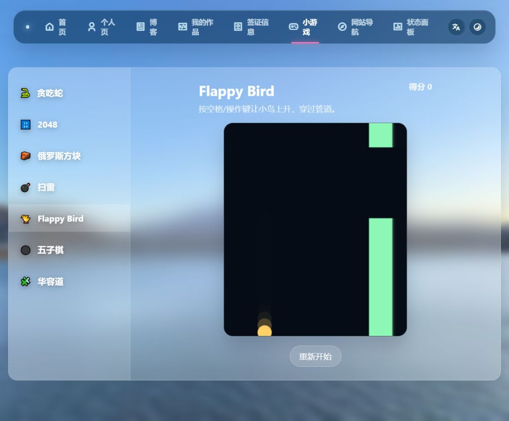
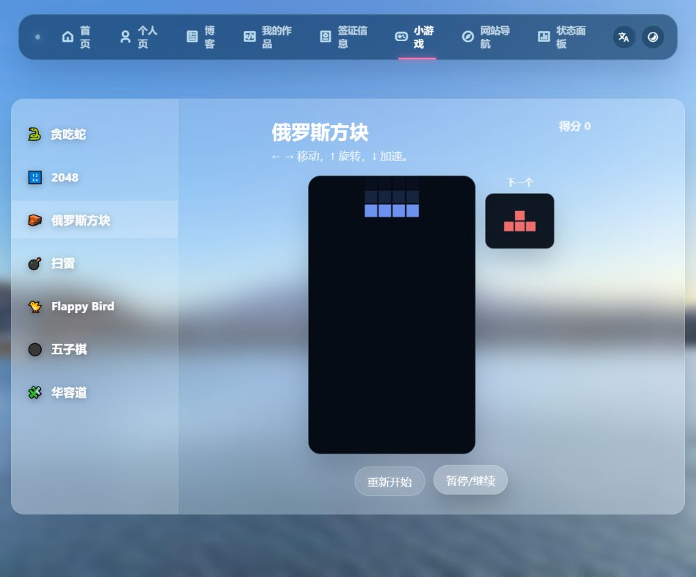
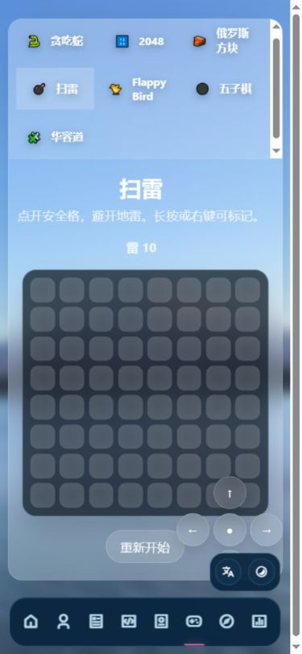
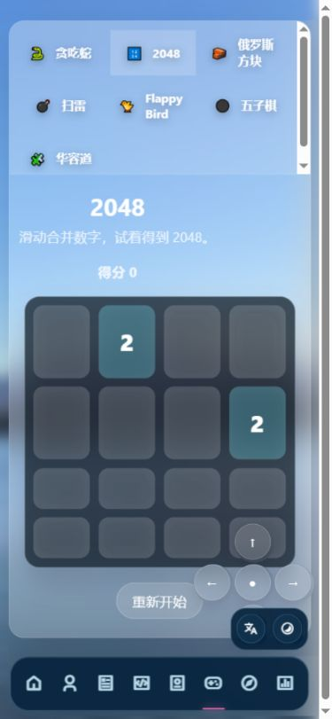
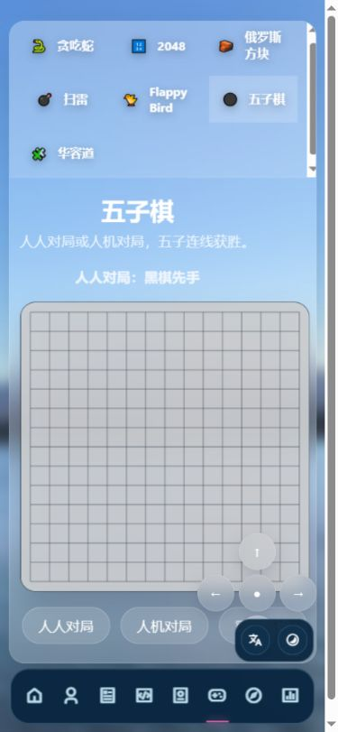
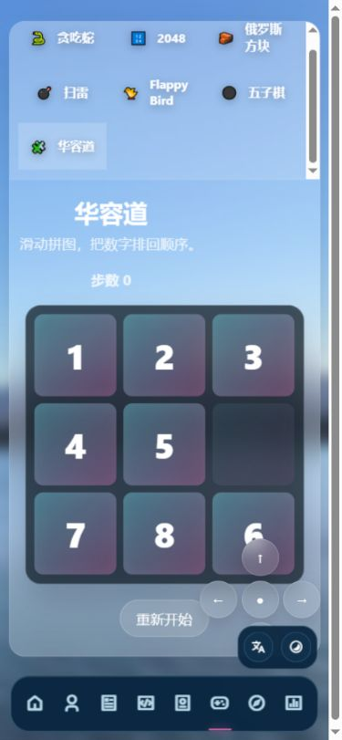

# 小游戏页检查记录

日期：2026-10-09。检查对象：本地 games.html。桌面默认视口与 390×844 手机视口模拟；结合截图、DOM 和当前源码。没有修改页面功能。

整体：七个游戏入口均可打开，2048 方向键移动、华容道点击移动及胜利提示有实际验证。主要问题集中在输入方式、开始/结束反馈与移动端遮挡。

## 优先问题

1. 高优先级：手机悬浮手柄遮挡棋盘和操作按钮。步骤 4–7 可见；扫雷、五子棋也显示无效方向键。应将控制区放在棋盘下方，并按游戏显示对应按键。
2. 高优先级：Flappy Bird 的空格控制受焦点影响。点击游戏选择按钮或重新开始后，按钮保留焦点，keydown 的 isNativeActivation 分支不执行 flap；空格触发按钮本身。桌面又没有可见飞行按钮，canvas 也没有点击飞行处理。应提供明确的飞行按钮或可聚焦游戏区域，并合理管理开始后的焦点。
3. 中优先级：贪吃蛇默认自动运行，初始位置到右边界约 1.3 秒；尚未读完说明就结束。Flappy Bird 切换进入也立即下落，且结束只停定时器，没有结束提示。应增加待开始状态、首次操作开始、结束和重试提示。
4. 中优先级：说明与实现不一致。扫雷承诺长按标记，但仅监听 contextmenu，没有自定义长按；部分移动浏览器可能产生 contextmenu，但不能据此保证长按体验。2048、华容道承诺滑动，源码无触摸滑动处理，实际支持方向控制和华容道点击。应补手势或改说明。
5. 中优先级：贪吃蛇和俄罗斯方块暂停后，按钮仍为“暂停/继续”，没有“已暂停”提示或 aria-pressed。应明确显示状态。
6. 中优先级：标题、说明、分数为白色或半透明白色，浅蓝玻璃背景下可读性偏弱；步骤 1、3–7 可见。应加强背景遮罩或使用更深文字。没有测量对比度，不能据此宣称 WCAG 合规或不合规。
7. 中优先级：扫雷 64 个未打开按钮没有可访问名称，DOM 中均显示空 button；五子棋 canvas 没有键盘落子方式，游戏选中状态仅靠 class。应补格子坐标/状态标签、键盘操作及选中语义。

## 代码边界问题（尚未通过完整游戏实测）

- placeSnakeFood 在蛇占满 400 格后会永远找不到空位，do/while 不结束。应先判定满盘胜利。
- 没有 visibilitychange / blur 自动暂停处理；切到其他浏览器标签后定时器仍可能继续，受浏览器节流影响。应对隐藏页面暂停，并明确恢复方式。
- 五子棋 AI 的 220ms 延时没有保存和取消，aiGobangMove 也不核验当前 gobangMode。极快地重开、换模式并落子可能让旧回调影响新对局，建议取消回调或校验对局编号。

## 检查步骤和截图

1. 桌面打开贪吃蛇：布局完整，但默认自动开局，截图已结束。

2. 桌面切换 Flappy Bird 并检查空格：入口正常，自动下落、结束反馈和按钮焦点有问题。

3. 桌面俄罗斯方块暂停：面板与下一个方块正常显示，暂停没有清晰状态反馈。

4. 手机扫雷：棋盘呈现正常，但手柄遮挡右下格子，说明承诺的长按缺少自定义实现。

5. 手机 2048：棋盘显示正常，右下格子被遮挡；另在桌面实测 ArrowLeft 后棋盘更新并出现新数字。

6. 手机五子棋：棋盘显示正常，手柄覆盖右下落子区和部分操作区；没有完成整盘对局。

7. 手机华容道：棋盘显示正常，右下数字被遮挡；另在桌面点击相邻 6 后步数由 0 变 1，并出现“你赢了”。

## 检查限制

手机是视口模拟，没有真实触屏长按、iOS/Android 浏览器测试。未穷尽所有游戏胜负、2048 合并排列、五子棋 AI 对局及读屏体验。查询时未捕获控制台 error/warn，这不代表所有路径无错误。截图按实际状态保存和回读检查。

建议顺序：先修手柄遮挡和 Flappy 输入，再统一开始/暂停/结束反馈，然后处理手势、可读性与边界逻辑。
